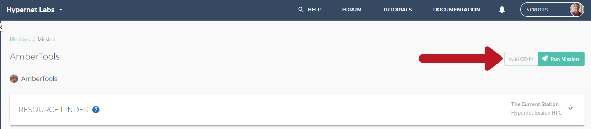

.. _billing:

Billing and Pricing
===================

Billing in Galileo is based on a credit balance system. Users purchase credits for their account from the billing portal and spend them within Galileo on software (Mission Frameworks) and hardware (Stations) resources.

Once you have configured a Mission in your Galileo account and are ready to launch a job, a price-per-hour figure will display near the run button.

This price is calculated based on the resources pricing of the particular Station and Mission Framework Type you have selected (if a user creates their own Station in Galileo, they can choose the price they charge users of their Station for their resources).

- For example, if you have selected to run on a Station which has a price of 1 credit per hour of CPU time, and your Mission is set to use 2 CPUs per job instance, then any job you launch from this setup will cost 2 credits per hour.
- If there is a cost for Memory (or GPUs if applicable), these costs will be calculated in a similar manner.

Users can purchase 1-time credits blocks in increments of 10, 100, or 1000. These 1-time credit blocks do not refill and must be repurchased manually if the user’s account balance is depleted. Importantly, long running applications will be terminated if the user’s account balance runs out before they purchase more 1-time credit blocks. Users can opt into credit limit notification through their notification settings page where in-app, email, and mobile push notifications are available. 

To avoid applications being prematurely terminated, a user may sign up for credit Autopilot. Autopilot will refill a user’s credit balance whenever their balance drops below the indicated refill limit.

- For example, if the Basic Autopilot package is selected, Galileo will automatically charge the user’s payment method to bring their account back up to 10 credits when their balance goes below 1 credit.

Software
--------

Software applications are available to users of the Galileo platform in the form of Mission Framework Types. The price to execute a job instance of a Mission Framework Type has two components: a base rate and an incremental resource rate. The base rate is applied as a simple credits per hour cost, while the incremental resource rate scales with the amount of hardware resources consumed by the job process.

- For example, if a Mission Framework Type has a base rate of 1 credit per hour and an incremental rate of 0.1 credits per CPU hour, then a job that is based on this Mission Framework running on 10 CPUs for 1 hour would cost 2 credits.

Hardware
--------

Hardware resources fall into three categories: CPUs, GPUs, and Memory. The cost for these resources is denoted in credits per CPU-hrs, credits per GPU-hrs, and credits per Gigabyte-hrs respectively and are configured at the `Station level <stations.html#station-resource-pricing>`_ (different Stations can have different prices which are set by the Station administrators). Additionally, Station administrators can choose to enable spend limits based on user roles and restrict the software that is allowed to run within the context of a specific Station<link to station admin settings>.

Invoicing Frequency
-------------------

A user’s credit balance will be deducted for every five (5) minutes of time that a job is in a running state (this includes a paused state, but does not include the time for building the container or its image, or the time required to upload a job’s results after it has exited). Find your credit invoices by navigating to the billing page and selecting the Invoices subtab on the left side of the screen.

