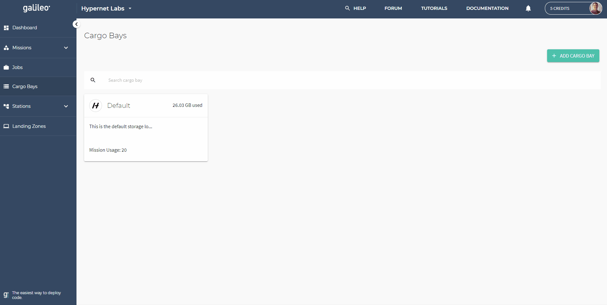

.. _cargobays:

Cargo Bays Guide
================

Cargo Bays is a Galileo feature that allows users to authenticate third-party storage solutions against their Galileo account. Once a Cargo Bay is established, it can be used in conjunction with the Missions feature; files and results belonging to a Mission can be configured to be stored in a particular Cargo Bay which can greatly help when the need arises to upload or download large amounts of data. Deleting a Cargo Bay only removes the encrypted authentication credentials Galileo uses to communicate with the storage provider, it does not delete the data that has been stored there. Additionally, deleting a Cargo Bay deactivates all Missions that reference it as a storage source. 

Creating a Cargo Bay 
--------------------

A Cargo Bay can be created by first clicking on the Cargo Bays tab in the UI Dashboard. Next, click the 'Add Cargo Bay' button in the upper right corner of the screen. This will bring up a configuration window. Here, you must select the third-party storage solution you would like to connect to your Galileo Account. 

Dropbox
~~~~~~~~

To connect your Dropbox account to Galileo, select the Dropbox option and and hit the "Dropbox Authentication" button. 

If you have never logged into your Dropbox in the current webbrowser, you will be redirected to the Dropbox login page. Once you give Galileo permission to access your Dropbox account, you will be brought back to the Galileo setup page. Next, provide a name for your Dropbox Cargo Bay, set the permission level (read and write permission is required for results to be written back to your Dropbox account), and optionally provide a description to denote the purpose of the Cargo Bay. 

The final step is to set the root folder of the Cargo Bay. This folder will set the highest folder access level that Missions will have when they refer to this Dropbox Cargo Bay. You must check the acknowledgment box before you can complete your setup. 

Once you have completed the setup, you will see your Dropbox Cargo Bay show up with the name and description you provided. The number of Missions that reference this Cargo Bay will also be displayed. 

NOTE: Deleting a Dropbox Cargo Bay does not delete data in Dropbox, it only removes Galileo's access to that Cargo Bay. 

Storj DCS
~~~~~~~~~

`Storj DCS <https://storj.io/signup/?partner=hypernet>`_ is a secure, decentralized, object storage provider. Using Storj with Galileo requires that you first create an account in one of their three availability regions and configure an initial Storj Project. 

Once you have an active Stroj Project, select the Storj option, this will bring up the fields you must enter to connect your Storj bucket to Galileo. 

The "API Key" field refers to the API key associated with the Tardigrade Project you are using. If you want to point to an existing bucket, enter that bucket name in the "Bucket Name" field and enter the bucket's encryption phrase into the "Encryption Passphrase" field. If you do not have an existing bucket, you can enter an arbitrary name and encryption phrase and Galileo will create a new bucket for you in the Tardigrade project associated with the provided API key. **WARNING**: If you do not save your encryption phrase, we cannot recover it for you. 

Once you've created the Storj-based Cargo Bay, you will see it appear in your Cargo Bays tab. The number of Missions referencing this Cargo Bay will be displayed here. 

If you toggle on "Use Storj Serialized Access", you must provide an Access Grant generated for you by the Storj service. See the `Storj DCS documentation <https://docs.storj.io/dcs/getting-started/satellite-developer-account/access-grants>`_ for generating an Access Grant. 

Associating a Cargo Bay with a Mission
---------------------------------------

Once you have successfully added a Cargo Bay to your Galileo account, you can use it as a data source/sink for new Missions. This is done as the final step of configuring your Mission (see the `Missions Guide <missions.html>`_ for more information on setting up a new Mission).

.. image:: images/mission_cargo_bay_link.gif

The "Default" storage option uses GCP Storage and is counted against your storage quota in the dashboard. Any data stored in your personal Cargo Bays is not counted against your storage quota. 