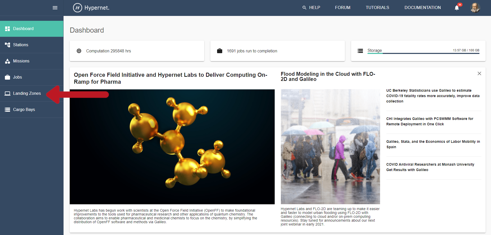

.. _landing_zone_docker:

QuickStart for Galileo Landing Zones and Docker
===============================================
The following is a user guide for deploying a Galileo Landing Zone
(LZ) using our official Docker image.

.. contents:: :local:
	 :depth: 2

Prerequisites
-------------
Docker must be installed on the machine you wish to use as a landing
zone. You can find installation instructions for all major operating
systems here:

* `Windows <https://docs.docker.com/docker-for-windows/install/>`_
* `Mac <https://docs.docker.com/docker-for-mac/install/>`_
* Linux
    * `CentOS <https://docs.docker.com/engine/install/centos/>`_
    * `Debian <https://docs.docker.com/engine/install/debian/>`_
    * `Fedora <https://docs.docker.com/engine/install/fedora/>`_
    * `Ubuntu <https://docs.docker.com/engine/install/ubuntu/>`_

How It Works
------------
Using our official Docker image to run a Landing Zone in a container
is a fantastic way to get started because it's easy to install,
update, manage, and clean up after. However there are a couple tricky
aspects that the following subsections will show you how to work
around. You will find these work arounds referenced throughout the
rest of the documentation.

Connecting to the Docker Daemon
~~~~~~~~~~~~~~~~~~~~~~~~~~~~~~~
On any system that runs Docker there is a background process called
the Docker daemon that controls all of Docker's moving parts. Regular
Docker commands like ``docker run`` can't make much happen on their
own; they make requests to the daemon over a socket. So when you use
our official image to deploy a Landing Zone the Docker daemon will
create a container for it and start the execution of that
container. The LZ in that container needs to run jobs, and to do that
it needs to be able to make Docker containers for those jobs. This
presents a challenge; the LZ must be able to communicate with the
Docker daemon but the daemon is running *outside* of the LZ's
container! To accomplish this you must *mount* the Docker daemon's
socket in the LZ's container. On Unix-like systems that looks like
:code:`docker ... -v /var/run/docker.sock:/var/run/docker.sock ...`
and on Windows systems that looks like :code:`docker ... -v
//./pipe/docker_engine://./pipe/docker_engine ...`.

Persisting and Accessing Application Files
~~~~~~~~~~~~~~~~~~~~~~~~~~~~~~~~~~~~~~~~~~
The LZ produces files that you might want to keep, like your
authentication token or error logs, but they are hard to access inside
the container and they are destroyed if the landing zone's container
is destroyed. To make these files easily accessible and persistent you
need to mount the directories containing them in the landing zone's
container. For example, if I want to keep a copy of my authentication
token to use across LZ sessions, then I would create a directory to hold it
(e.g. ``$ mkdir $HOME/lz_token``), mount the directory, and use the
``--token`` flag to tell the LZ to look for it at the mount point:
``docker ... -v $HOME/lz_token:/lz_token
... hypernetlabs/landing-zone-daemon --token /lz_token/auth.token
...``. A convenient way to mount all non-temporary application files
would be to mount a configuration directory and use the
``--config-dir`` flag to tell the LZ where it is mounted. So if you
have a directory at ``$HOME/.galileod`` you might use a command like
this: ``docker ... -v $HOME/.galileod:/config_dir ... hypernetlabs/landing-zone-daemon --config-dir
/config_dir``.

How to Run the Landing Zone Daemon
----------------------------------
* Make sure that Docker is running.
* Open a terminal
    * Windows: open a cmd prompt or a Powershell
    * Mac: Press Cmd+Space to open Spotlight Search, type "terminal", and press Return.
    * Linux: You can try Ctrl+Alt+T. If that doesn’t work you should find instructions for your distribution.
* This is a good time to `test your Docker installation
  <https://docs.docker.com/get-started/#test-docker-installation>`_.
* Choose the name you’d like this LZ to have when viewed in the
  Galileo web interface. We will refer to the LZ name as
  :code:`$LZ_NAME`. When you see :code:`$LZ_NAME` referenced, simply
  substitute your chosen name in its place.
* Copy the following command, paste it in the terminal, substitute the
  name you chose for :code:`$LZ_NAME`, and run the command by pressing
  Enter or Return and wait for the process to finish.

.. code-block:: bash

    # For running Linux containers
    $ docker run -d -v /var/run/docker.sock:/var/run/docker.sock -v tokens:/tokens --name landing-zone-daemon hypernetlabs/landing-zone-daemon --name "$LZ_NAME" --token /tokens/token

    # For running Windows containers
    > docker run -d -v //./pipe/docker_engine://./pipe/docker_engine -v tokens:C:/tokens --name landing-zone-daemon hypernetlabs/landing-zone-daemon --name "$LZ_NAME" --token C:/tokens/token

* Now that the LZ is running, we must authenticate it against your
  account. Run this command in your terminal

.. code-block:: bash

    $ docker logs landing-zone-daemon

* This should give you some output that looks like this

.. code-block:: bash

    Pulling updates…
    Already up to date!
    Please visit the following url in your browser and enter the code below
    URL: https://galileoapp.auth0.com/activate
    Code: XXXX-XXXX

* Follow those instructions. Once you have confirmed your code at the
  provided URL you should see your new Landing Zone appear in the
  Galileo Landing Zones tab as show below! The dot next to the LZ name 
  will be green when the LZ is online. If the LZ is stopped or the host 
  machine is turned off, this will disconnect the LZ session and the dot 
  will turn red. If you do not want a particular LZ to appear in the UI 
  anymore, click the delete button. 

* In order to submit jobs to your new LZ, you must add it to a `Station <stations.html>`_. 
  You can create a new Station by going to the Stations tab and clicking 
  the Create Stations button.

Stopping and Restarting the Landing Zone Daemon
-----------------------------------------------
* Open a terminal as you did above
* Run this command to stop the Landing Zone

.. code-block:: bash

    $ docker stop landing-zone-daemon

* Run this command to restart the Landing Zone

.. code-block:: bash

    $ docker start landing-zone-daemon

* You should not have to re-authenticate this time!

Removing and Restarting the Landing Zone daemon
-----------------------------------------------
* Open a terminal as you did above
* To remove the Landing Zone daemon container from your Docker
  installation, first stop the Landing Zone, then run this command

.. code-block:: bash

    $ docker rm landing-zone-daemon

* To install the Landing Zone daemon again follow the instructions
  above. You may or may not need to reauthenticate depending on
  whether you delete the Docker volume called "tokens" that was
  created when you started the landing zone.

Enabling GPUs
--------------

Currently Galileo only supports NVIDIA GPUs on Linux systems. If you
require support from other manufacturers please let us know!

GPUs are allocated to jobs in exactly the same way as CPUs
are. Missions may require some number of GPUs to run, and jobs will
wait in a station's queue until space on an LZ with that many GPUs
becomes available. A job has exclusive access to the GPUs allocated to
it for its entire lifetime.

Please see `Docker's instructions
<https://docs.docker.com/config/containers/resource_constraints/#gpu>`_
for installing the necessary drivers and container runtime for your hardware.

To make your GPUs accessible to your Landing Zone, just add the
``--gpus`` flag to your Docker invocation.

.. code-block:: bash

	 $ docker run ... --gpus all ... hypernetlabs/landing-zone-daemon ...

This is also your opportunity to configure exactly which GPUs are
exposed to Galileo. If for instance you have 2 GPUs of one variety and
2 of another, then you could start two LZs, one for each type of GPU.

.. code-block:: bash

	 $ docker run ... --gpus 0,1 ... hypernetlabs/landing-zone-daemon --name tesla-t4
	 $ docker run ... --gpus 2,3 ... hypernetlabs/landing-zone-daemon --name tesla-k80

You can further configure access to GPUs station-wide in the Station
Settings page or as they apply to a specific mission on the Mission
Settings page.

How to Run, Stop, and Remove the Landing Zone daemon using Docker Compose
-------------------------------------------------------------------------

Running the Landing Zone daemon
~~~~~~~~~~~~~~~~~~~~~~~~~~~~~~~

* Make sure that Docker is running
* Open a terminal as you did above
* To install Docker Compose: If you have python and pip installed on
  your machine, copy the following command, paste it in the terminal,
  and run the command by pressing Enter or Return.

.. code-block:: bash

    $ pip install docker-compose

* Alternatively, follow the instructions for your operating system
  given `here <https://docs.docker.com/compose/install/>`_.
* If you are running **linux** containers, download this .yml file
  :download:`(download, right-click and save) <linux/docker-compose.yml>`:

.. code-block:: yaml

    version: "3.3"
    services:
      landing-zone:
        image: hypernetlabs/landing-zone-daemon
        volumes:
          - /var/run/docker.sock:/var/run/docker.sock
          # uncomment the following line if you need your LZ to have access to private Docker Hub repositories
          #- ${HOME}/.docker/config.json:/root/.docker/config.json
          - tokens:/tokens
        container_name: landing-zone-daemon
        # chose the name that appears in the Galileo UI and make a unique string that corresponds to it
        command: --token /tokens/authfile.txt --name "$LZ_NAME"
        environment:
          DOCKER_HOST: unix:///var/run/docker.sock
    volumes:
      tokens:

* If you are running **Windows** containers, download this .yml file
  :download:`(download, right-click and save) <linux/docker-compose.yml>`:

.. code-block:: yaml

    version: "3.3"
    services:
      landing-zone:
        image: hypernetlabs/landing-zone-daemon
        volumes:
          - source: '\\.\pipe\docker_engine'
            target: '\\.\pipe\docker_engine'
            type: npipe
          - tokens:C:\tokens
          # uncomment the following line if you need to access private image repos with your Landing Zone
          #- C:\$homepath\.docker:C:\Users\ContainerAdministrator\.docker
        container_name: landing-zone-daemon
        # chose the name that appears in the Galileo UI and make a unique string that corresponds to it
        command: --token C:\\tokens\\authfile.txt --name "$LZ_NAME"
    volumes:
      tokens:

* Be sure to change :code:`$LZ_NAME` to your desired name to be
  displayed in the user interface.

* Open a terminal and navigate to the folder were the .yml file was downloaded. 
  Copy the commands below and paste them into the terminal to pull the
  Landing Zone image and run the Landing Zone daemon:

.. code-block:: bash

    $ docker-compose pull
    $ docker-compose up -d

* Now that the LZ is running, we must authenticate it. Run this
  command in your terminal

.. code-block:: bash

    $ docker-compose logs

* This should give you some output that looks like this

.. code-block:: bash

    Pulling updates…
    Already up to date!
    Please visit the following url in your browser and enter the code below
    URL: https://galileoapp.auth0.com/activate
    Code: XXXX-XXXX

* Follow those instructions. Once you have confirmed your code at the
  provided URL you should see your new Landing Zone appear in Galileo!

**Note:** If you are using MacOS and you are having trouble, check
your :code:`~/.docker/config.json` and delete :code:`"credsStore" :
"osxkeychain"`.

**Note:** If you are using Windows 10 Desktop or Windows Server and
you are trying to run jobs referencing private images, edit your
:code:`C:\%homepath%\.docker\config.json` so that the credStore line
is as follows: :code:`"credsStore" : ""`. Then re-authenticate your
docker daemon by running :code:`docker login`. Be sure to uncomment
the line in the .yml file that mounts :code:`C:\$homepath\config.json`

**Note:** If you are using Windows 10 Desktop or Windows Server to run
Windows containers, be aware that the default storage limit size is 
20 GB. If you are running simulations that produce multiple GB of results
files, you are likely to hit this limit which will cause your simulation to 
crash. See the `Microsoft Docs <https://docs.microsoft.com/en-us/virtualization/windowscontainers/manage-containers/container-storage>`_ 
for how to increase the storage limits for Windows containers. 

Stopping and Restarting
~~~~~~~~~~~~~~~~~~~~~~~

* Open a terminal as you did above
* Run this command to stop the Landing Zone

.. code-block:: bash

    $ docker-compose down

* Run this command to restart the Landing Zone

.. code-block:: bash

    $ docker-compose up -d

* You should not have to re-authenticate this time!

Removing and Restarting
~~~~~~~~~~~~~~~~~~~~~~~~

* By running the stop command above, you automatically remove the
  container
* To install the Landing Zone daemon again follow the instructions
  above. You should not need to reauthenticate if you do not delete
  the landing-zone_tokens docker volume that stores your
  authentication token.
