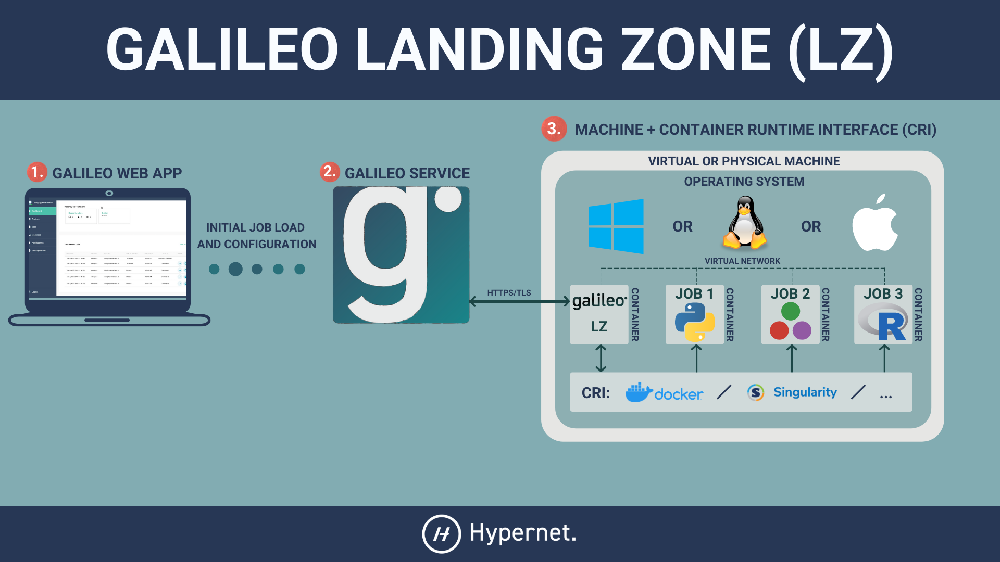

.. _landing_zone_main:

====================
Galileo Landing Zone
====================

Introduction
------------
The Galileo Landing Zone (LZ) is what receives jobs, organizes the
resources necessary to run them, tracks their progress as they run,
and returns their results. A user would setup an LZ on whatever
computational resource they wish to make available in the Galileo web
application. It runs as a daemon process, usually in its own
container, and launches jobs by running them in their own containers.

Getting Started
---------------

We suggest that you use our officially supported Docker image to run
an LZ. The LZ has experimental support for running from inside a
Singularity container and in a Slurm cluster. Choose the link that
fits your needs to find installation and execution instructions.

.. toctree::
   :maxdepth: 1

    Docker <landing_zone_docker.rst>
    Singularity <landing_zone_singularity.rst>
    Slurm <landing_zone_slurm.rst>

How It Works
------------
When you start the LZ the first time you will be met with an
authentication prompt. This process creates a token that the LZ uses
to authenticate itself with our Galileo service. You can choose to
store this token to skip this prompt in the future. After the LZ
authenticates itself it will establish an encrypted WebSocket
connection with our Galileo service. The LZ listens for instructions
and events on the WebSocket connection and responds to them
accordingly.

When a job gets dispatched to a Landing Zone the LZ first collects the
details necessary to construct the job's environment: cores required,
memory required, and any other hardware requirements. The LZ then
downloads the files and data belonging to the job and uses them to
construct a container according to the hardware specifications
collected earlier. The LZ will then initiate the container's execution
and respond to user requests to pause, unpause, and kill the job. When
the container process has ended the LZ creates a zip archive of the
process' stdout, stderr, and any new or changed files found in the
``/home/galileo`` directory. The LZ then uploads that archive to the
Galileo service so that you can download it and get your results!
Finally the LZ destroys anything it constructed to create the job
container and releases those resources back to its host.

Command Line Flags
------------------
``--config-dir``   ``<DIRECTORY_PATH>``
  By default this is set to, in order of priority, ``HOME/.galileod``,
  ``HOMEPATH/.galileod``, or the current working directory. If the
  directory does not exist, then it will be created. This is the
  default location for tokens, logs, and any other non-temporary
  application files.

``--config``   ``<FILE_PATH>``
  The landing zone will look to this value for a local configuration
  file. The default value is ``<CONFIG_DIR>/galileod.conf``; see the
  ``--config-dir`` flag for more information.

``--log`` / ``-o``   ``<FILE PATH>``
  The LZ's stderr will be stored at the path specified by this
  flag. The default behavior is to store the log in
  ``$HOME/.galileod/logs``. If you use the special value of a single
  hyphen ``-`` then logging information will be printed to stderr.

``--log-max``   ``<INTEGER>``
  This is the maximum size of the log file in bytes. When the log file
  approaches this size it will add a ``.bk`` suffix to the file name
  and start a new log file. If a log file already exists with the
  ``.bk`` suffix then it will be overwritten. Popular case-insensitive
  shorthand for units may be appended, e.g. ``--log-max 100MB`` is 100
  megabytes and ``--log-max 100mib`` is 100 mebibytes.

``--log-color`` / ``--no-log-color``
  These flags are used to enable and disable log highlighting. By
  default no colors are added to log files, and colors are added to
  logs printed to stderr.

``--container`` / ``-c``   ``<CONTAINER TYPE>``
  Use this to specify the container technology the jobs should run
  under. Valid values are ``docker`` (the default), ``singularity``
  (experimental), and ``slurm`` (experimental). The LZ will do a
  preliminary check to ensure it is capable of using that technology.

``--name`` / ``-n``   ``<TEXT>``
  This sets the name of the Landing Zone that you will see displayed
  in the web application. By default the host's hostname will be used.

``--token`` / ``-t``   ``<FILE PATH>``
  Upon completion of the authentication prompt the LZ will store a 45
  byte token at this location. This token will allow the LZ to
  authenticate automatically in the future. By default the token is
  stored at ``$HOME/.galileod/token``. If you specify ``none`` for
  this value, then the token will be held in memory only and not
  stored on the filesystem. If a token is already stored at this
  location, then it will be utilized and the LZ will authenticate
  automatically without prompting the user.

Configuration File
------------------
The Landing Zone priority of configuration values, from high to low,
is as follows:

1. Command Line Flags

2. Local Configuration File

3. Global Configuration File

4. Default Values

The location of the local configuration file is controlled by the
``--config`` flag. The global configuration file is always searched
for at ``/etc/galileod.conf`` on Unix-like systems and it is not
searched for on Windows systems.

Configuration files are JSON formatted. Every command line flag has a
corresponding property name (except ``--config``) with hyphens
substituted for underscores (e.g. ``--log-max`` becomes
``"log_max"``). Property values are strings unless otherwise noted,
and they may reference environment variables; ``$VARNAME`` and
``${VARNAME}`` will both work on all systems and ``%VARNAME%`` will
work on Windows systems. Boolean flags map to one name of the positive
form that takes a Unicode boolean value (e.g. ``--log-color`` and
``--no-log-color`` become ``"log_color": true`` and ``"log_color":
false`` respectively).

The following is an example configuration file that utilizes default
values

.. code-block:: json

	 {
	   "config_dir": "$HOME/.galileod",
	   "log": "$HOME/.galileod/log.txt",
	   "log_max": "25MB",
	   "log_color": true,
	   "container": "docker",
	   "name": "$HOSTNAME",
	   "token": "$HOME/.galileod/token"
	 }

