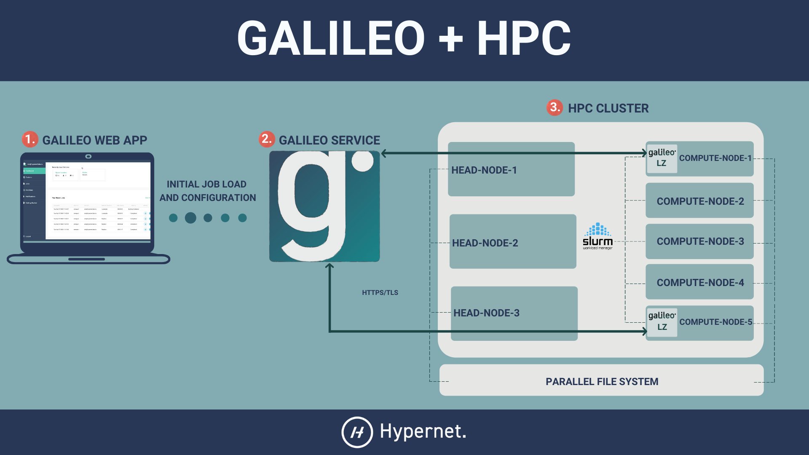

.. _landing_zone_slurm:

Quickstart for Galileo Landing Zones and SLURM
==============================================

The following is a user guide for deploying a Galileo Landing Zone
(LZ) in a SLURM cluster.

Prerequisites
-------------

A SLURM client must be installed on the machine you wish to use as a
Landing Zone. It must be configured to correctly run basic commands like
``srun`` and ``squeue``.

Singularity must also be installed on the cluster that you wish to
target.

You can download the statically linked (amd64 Linux) Landing Zone
executable `here
<https://storage.googleapis.com/landing-zone-daemon/galileod>`_. Put
this somewhere in your ``$PATH`` such that ``galileod --help`` runs
successfully.

It is also assumed by the LZ that ``/tmp`` belongs to a distributed
file system that is readable and writable by every node in the
cluster. You can override this location by setting the ``$TMPDIR``,
``$TEMP``, or ``$TMP`` environment variables.

How It Works
------------
The Galileo Landing Zone naturally lends itself to a clustered
environment. In combination with our web application, it can be used
as a user-friendly gateway to the cluster. It can also be submitted as
a pilot job to the cluster so as to take advantage of Galileo's
station queueing systems.

As a Gateway
~~~~~~~~~~~~~~~

The Landing Zone can be run on the headnode of a cluster and interact directly with its pre-existing SLURM resource scheduler.

.. image:: images/Galileo_HPC_gateway.png

In the SLURM configuration the LZ receives the details of a job, builds 
a Singularity container for the job in ``/tmp``, and issues an ``srun`` 
command to execute the container. Periodic calls to ``squeue`` and
``sstat`` are used to track the job's progress. When the job finishes
the LZ collects any new and modified files in the container and returns
them to the user. Finally the LZ deletes any trace of the job's container
from the filesystem.

As a Pilot Job
~~~~~~~~~~~~~~

An alternative way to use the Landing Zone in a clustered environment
is to send a batch of Landing Zones to run in the cluster as pilot
`jobs <https://en.wikipedia.org/wiki/Pilot_job>`_. 

By submitting the 
Landing Zone as a job to the cluster, a user need only wait in the 
cluster queue once; thereafter they can skip the cluster's queue and 
submit jobs directly to the LZ! Landing Zones in this circumstance will 
be running in a :ref:`Singularity configuration <landing_zone_singularity>`.

How to Run the Landing Zone Daemon
----------------------------------

As a Gateway
~~~~~~~~~~~~
Choose the name you’d like this LZ to have when viewed in the Galileo
web interface. We will refer to the LZ name as :code:`$LZ_NAME`. When
you see :code:`$LZ_NAME` referenced, simply substitute your chosen
name in its place.

* You should invoke the LZ as follows:

.. code-block:: bash

    $ galileod --container slurm --name "$LZ_NAME"

* You should see some output that looks like this

.. code-block:: bash

    Pulling updates…
    Already up to date!
    Please visit the following url in your browser and enter the code below
    URL: https://galileoapp.auth0.com/activate
    Code: XXXX-XXXX

* Follow those instructions. Once you have confirmed your code at the
  provided URL you should see your new Landing Zone appear in the
  Galileo Landing Zones tab! In order to submit jobs to your new LZ,
  you must add it to a Station. You can create a new Station by going
  to the Stations tab and clicking the Create Stations button.

As a Pilot Job
~~~~~~~~~~~~~~
Choose the name you’d like this LZ to have when viewed in the Galileo
web interface. We will refer to the LZ name as :code:`$LZ_NAME`. When
you see :code:`$LZ_NAME` referenced, simply substitute your chosen
name in its place.

* Submit the Landing Zone as a job to to the cluster. Be sure to
  specify stdout redirection so that you can read it later.

.. code-block:: bash

    $ srun -o landing-zone-daemon.out singularity run --fakeroot library://hypernetlabs/default/landing-zone-daemon landing-zone-daemon --name "$LZ_NAME"

* Now that the LZ is running, we must authenticate it against your
  account. Run this command in your terminal

.. code-block:: bash

    $ cat landing-zone-daemon.out

* This should give you some output that looks like this

.. code-block:: bash

    Pulling updates…
    Already up to date!
    Please visit the following url in your browser and enter the code below
    URL: https://galileoapp.auth0.com/activate
    Code: XXXX-XXXX

* Follow those instructions. Once you have confirmed your code at the
  provided URL you should see your new Landing Zone appear in the
  Galileo Landing Zones tab! In order to submit jobs to your new LZ,
  you must add it to a Station. You can create a new Station by going
  to the Stations tab and clicking the Create Stations button.

As a Batch of Pilot Jobs
~~~~~~~~~~~~~~~~~~~~~~~~

You will need a naming pattern to uniquely identify the batch of LZs
when viewed in the Galileo web interface. The recommended approach is
to use a job array and some pattern based on the
``$SLURM_ARRAY_TASK_ID``. Whatever you decide it needs to be used with
``galileod``'s ``--name`` flag.

It is also recommended that you generate a persistent authentication
token as a prerequisite and pointing your batch LZs at it with the
``--token`` flag.

* Create a job submission file with contents similar to the
  following. Please adjust the values to fit your needs and
  circumstances. Assume the name of this file is
  ``landing-zone-daemon.batch``

.. code-block:: bash

    #!/bin/sh
    #SBATCH --job-name=batch_pilot_landing_zones
    #SBATCH --output=/tmp/galileod_%a.out
    #SBATCH --error=/tmp/galileod_%a.err
    #SBATCH --array=0-3
    #SBATCH --ntasks=1

    srun \
    singularity run --fakeroot \
    library://hypernetlabs/default/landing-zone-daemon \
    --name pilot_$SLURM_ARRAY_TASK_ID \
    --token /tmp/token

* Submit the batch with this command

.. code-block:: bash

   $ sbatch landing-zone-daemon.batch

* In order to submit jobs to your new LZs you must add them to a
  Station. You can create a new Station by going to the Stations tab
  and clicking the Create Stations button.

* And of course you can stop your Landing Zones using the ``scancel`` command

.. code-block:: bash

    $ scancel --name batch_pilot_landing_zones
