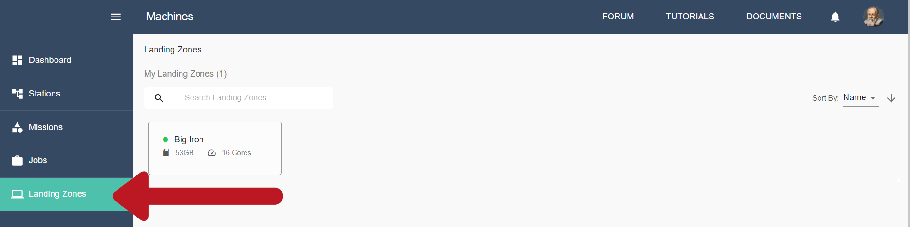

.. _lz:

Quickstart for Landing Zones
============================

The Galileo Landing Zone (LZ) daemon is a containerized daemon process that facilitates the deployment of containerized jobs from the Galileo web-service. The LZ daemon pulls input file and metadata, runs the associated containerized job, monitors its health and status, and posts the results of completed jobs back to the Galileo web-service. Access to machines running the LZ is controlled via the `Stations <stations.html>`_ feature, where Station administrators set permissions and resource limitations. 

.. image:: images/Galileo_LZ.png

Prerequisites
-------------

Docker must be installed on the machine you wish to use as a landing zone. You can find installation instructions for all major operating systems here:

* `Windows <https://docs.docker.com/docker-for-windows/install/>`_
* `Mac <https://docs.docker.com/docker-for-mac/install/>`_
* Linux
    * `CentOS <https://docs.docker.com/engine/install/centos/>`_
    * `Debian <https://docs.docker.com/engine/install/debian/>`_
    * `Fedora <https://docs.docker.com/engine/install/fedora/>`_
    * `Ubuntu <https://docs.docker.com/engine/install/ubuntu/>`_
|
How to Run the Landing Zone daemon
----------------------------------
* Make sure that Docker is running.
* Open a terminal
    * Windows: open a cmd prompt or a Powershell 
    * Mac: Press Cmd+Space to open Spotlight Search, type "terminal", and press Return.
    * Linux: You can try Ctrl+Alt+T. If that doesn’t work you should find instructions for your distribution.
* This is a good time to `test your Docker installation <https://docs.docker.com/get-started/#test-docker-installation>`_.
* Choose the name you’d like this LZ to have when viewed in the Galileo web interface. We will refer to the LZ name as :code:`$LZ_NAME`. When you see :code:`$LZ_NAME` referenced, simply substitute your chosen name in its place.
* Copy the following command, paste it in the terminal, substitute the name you chose for :code:`$LZ_NAME`, and run the command by pressing Enter or Return and wait for the process to finish.

.. code-block:: bash

    $ docker run -d -v /var/run/docker.sock:/var/run/docker.sock -v tokens:/tokens --name landing-zone-daemon hypernetlabs/landing-zone-daemon --machine-name "$LZ_NAME" --refresh-token-file /tokens/token

* Now that the LZ is running, we must authenticate it against your account. Run this command in your terminal

.. code-block:: bash

    $ docker logs landing-zone-daemon

* This should give you some output that looks like this

.. code-block:: bash

    Pulling updates…
    Already up to date!
    Please visit the following url in your browser and enter the code below
    URL: https://galileoapp.auth0.com/activate
    Code: XXXX-XXXX

* Follow those instructions. Once you have confirmed your code at the provided URL you should see your new Landing Zone appear in the Galileo Landing Zones tab as show below! The dot next to the LZ name will be green when the LZ is online. If you stop the LZ container or turn your host machine off, this will disconnect the LZ session and the dot will turn red.  

* In order to submit jobs to your new LZ, you must add it to a `Station <stations.html#adding-a-landing-zone-to-your-station>`_. You can create a new Station by going to the Stations tab and clicking the Create Stations button.

|
Stopping and Restarting the Landing Zone daemon
-----------------------------------------------
* Open a terminal as you did above
* Run this command to stop the Landing Zone

.. code-block:: bash

    $ docker stop landing-zone-daemon

* Run this command to restart the Landing Zone

.. code-block:: bash

    $ docker start landing-zone-daemon

* You should not have to re-authenticate this time!
|
Removing and Restarting the Landing Zone daemon
-----------------------------------------------
* Open a terminal as you did above
* To remove the Landing Zone daemon container from your Docker installation, first stop the Landing Zone, then run this command

.. code-block:: bash

    $ docker rm landing-zone-daemon

* To install the Landing Zone daemon again follow the instructions above. You may or may not need to reauthenticate depending on whether you delete the Docker volume called "tokens" that was created when you started the landing zone.
|
How to Run, Stop, and Remove the Landing Zone daemon using Docker Compose
-------------------------------------------------------------------------
Running the Landing Zone daemon
###############################

* Make sure that Docker is running
* Open a terminal as you did above
* To install Docker Compose: If you have python and pip installed on your machine, copy the following command, paste it in the terminal, and run the command by pressing Enter or Return.

.. code-block:: bash

    $ pip install docker-compose

* Alternatively, follow the instructions for your operating system given `here <https://docs.docker.com/compose/install/>`_. 
* If you are running linux containers, download this .yml file `(download, right-click and save) <docker-compose.yml>`_:

.. code-block:: yaml

    version: "3.3"
    services:
      landing-zone:
        image: hypernetlabs/landing-zone-daemon:head
        volumes:
          - /var/run/docker.sock:/var/run/docker.sock
          # uncomment the following line if you need your LZ to have access to private Docker Hub repositories
          #- ${HOME}/.docker/config.json:/root/.docker/config.json
          - tokens:/tokens
        container_name: landing-zone-daemon
        # chose the name that appears in the Galileo UI and make a unique string that corresponds to it
        command: --refresh-token-file /tokens/authfile.txt --backend 'https://api.galileoapp.io' --machine-name "$LZ_NAME"
        environment:
          DOCKER_HOST: unix:///var/run/docker.sock
    volumes:
      tokens:

* If you are on a windows host and running windows containers, copy this into a text file named docker-compose.yml:

.. code-block:: yaml

    version: "3.3"
    services:
      landing-zone:
        image: hypernetlabs/landing-zone-daemon:head
        volumes:
          - source: '\\.\pipe\docker_engine'
            target: '\\.\pipe\docker_engine'
            type: npipe
          - tokens:C:\tokens
          # uncomment the following line if you need to access private image repos with your Landing Zone
          #- C:\$homepath\.docker:C:\Users\ContainerAdministrator\.docker
        container_name: landing-zone-daemon
        # chose the name that appears in the Galileo UI and make a unique string that corresponds to it
        command: --log-file - --refresh-token-file C:\\tokens\\authfile.txt --backend 'https://api.galileoapp.io' --machine-name "$LZ_NAME"
    volumes:
      tokens:
* Be sure to change :code:`$LZ_NAME` to your desired name to be displayed in the user interface. 
* In the same folder as the .yml file, copy the commands below and paste in a terminal to pull the Landing Zone image and run the Landing Zone daemon:

.. code-block:: bash

    $ docker-compose pull
    $ docker-compose up -d

* Now that the LZ is running, we must authenticate it. Run this command in your terminal

.. code-block:: bash

    $ docker-compose logs

* This should give you some output that looks like this

.. code-block:: bash

    Pulling updates…
    Already up to date!
    Please visit the following url in your browser and enter the code below
    URL: https://galileoapp.auth0.com/activate
    Code: XXXX-XXXX

* Follow those instructions. Once you have confirmed your code at the provided URL you should see your new Landing Zone appear in Galileo!

**Note:** If you are using MacOS and you are having trouble, check your :code:`~/.docker/config.json` and delete :code:`"credsStore" : "osxkeychain"`.

**Note:** If you are using Windows 10 Desktop or Windows Server and you are trying to run jobs referencing private images, edit your :code:`C:\%homepath%\.docker\config.json` so that the credStore line is as follows: :code:`"credsStore" : ""`. Then re-authenticate your docker daemon by running :code:`docker login`. Be sure to uncomment the line in the .yml file that mounts :code:`C:\$homepath\config.json`

Stopping and Restarting
#######################
* Open a terminal as you did above
* Run this command to stop the Landing Zone

.. code-block:: bash

    $ docker-compose down

* Run this command to restart the Landing Zone

.. code-block:: bash

    $ docker-compose up -d

* You should not have to re-authenticate this time!

Removing and Restarting
#######################
* By running the stop command above, you automatically remove the container
* To install the Landing Zone daemon again follow the instructions above. You should not need to reauthenticate if you do not delete the landing-zone_tokens docker volume that stores your authentication token.
