.. _missions:

Missions Guide
==============================================

Missions are a feature of Galileo that allow users to easily configure complex simulators and scripting environements to run repeatibly and reliably on any `LZ <landing_zones.html>`_ that they have launch access to through a `Station <stations.html>`_. After the initial configuration, your Mission environment (which consists of your input files and framework parameters) can be updated quickly through the Mission settings page. See the `Galileo Tutorials <https://hypernetlabs.io/galileo/tutorials/#tutorials>`_ page for instructions on how to configure a Mission for specific applications. 

Creating a New Mission 
-----------------------

To create a new Mission in Galileo, go to the Missions tab on the left side of the UI. 

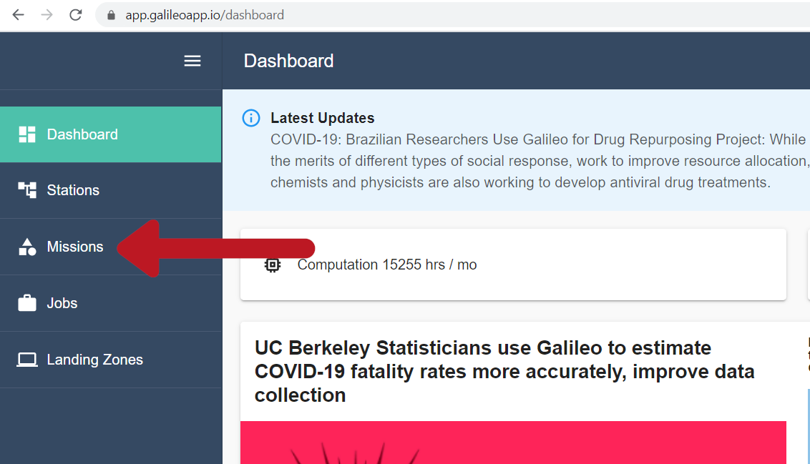

There are two ways to create a new mission. You can drag and drop a folder from your local hard-drive to the area on the UI that says "Add a Mission" (which will automatically upload the contents of that folder once the configuration step is complete), or you can start a new empty Mission by clicking the "Create a custom mission" button in the upper right.

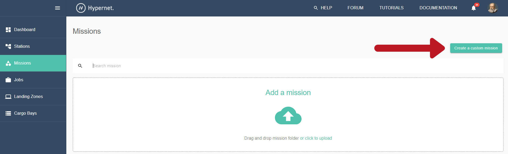

This will launch the Mission configuration wizard which is covered in the next subsection. See the `Galileo Tutorials <https://hypernetlabs.io/galileo/tutorials/#tutorials>`_ for step-by-step instructions for specific frameworks. 

Configuring Your Mission Type
-------------------------------

Galileo supports many scripting languages (such as R, Python, Julia, and Stata) and simulators (Gromacs, HECRAS, AmberTools, etc.) right out-of-the-box. The first step in configuring your Mission is to select your target framework from the drop-down list. 

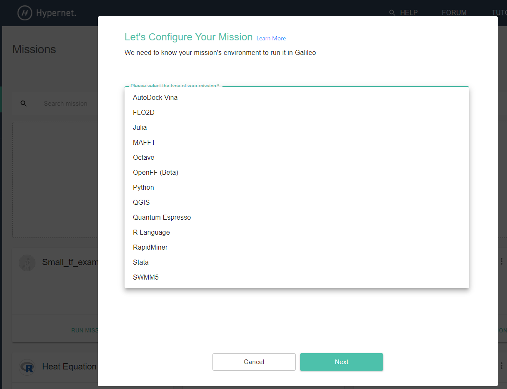

After you made your selection, follow the prompt to completion. 
 
Adding and Removing Files 
--------------------------

To see the files associated with a specific Mission, click the Missions tab on the left side of the screen, then select the particular Mission you wish to modify. 

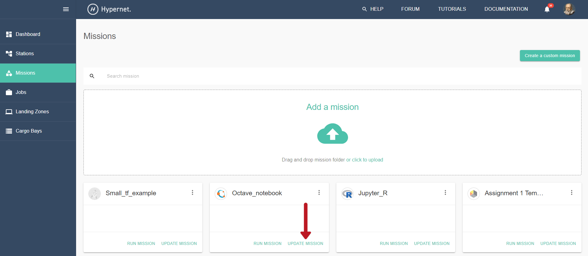

This will open the home page for that Mission where you can see all files associated with it. To upload files, click the "Create File" button. This will open a file explorer (if you intend to add a folder to your Mission, you can click the "Upload Folder" button instead). 

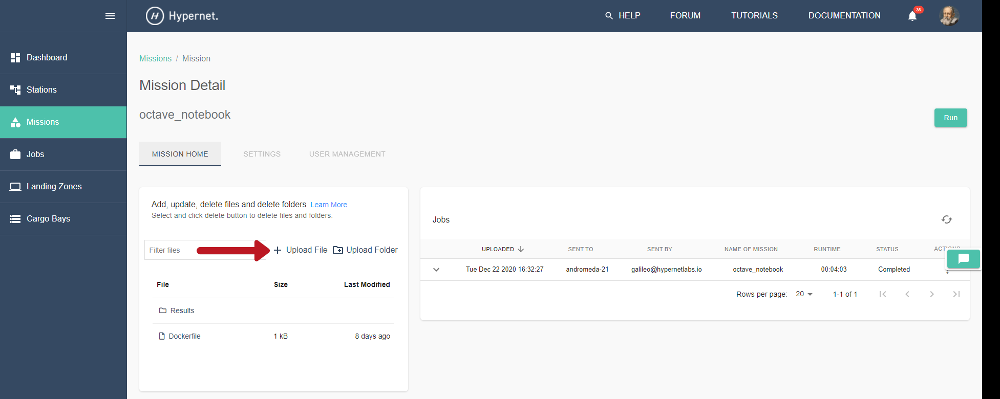

Select one or more files from your file explorer to add to your Mission environment. Once the file(s) upload, they will appear in the Mission home page as show below. 

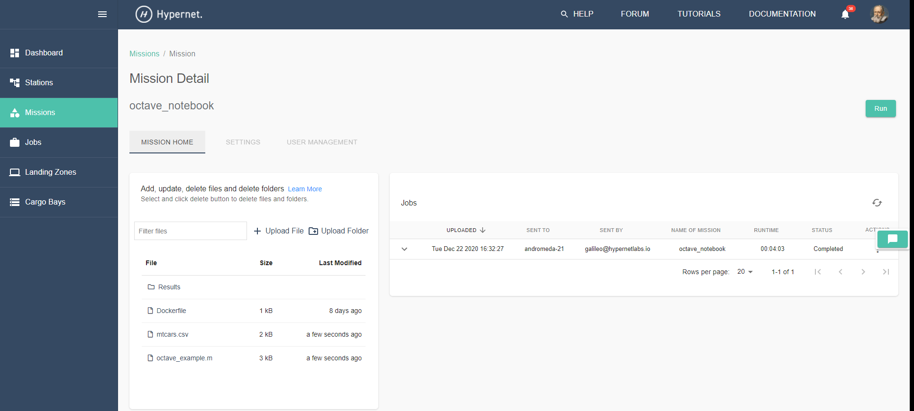

To delete a file from a Mission, first select the file you wish to remove by clicking on it. This will bring up a trashcan icon in the upper right. Click the trashcan icon. 

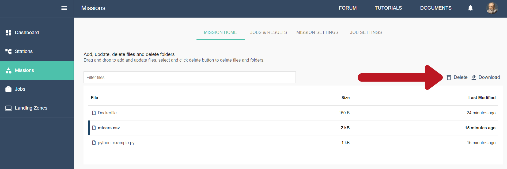

After confirming the deletion, the file will be permanently removed. 

Jobs and Job Results
---------------------

The "Job Settings" tab allows you to set how many CPUs and the amount of RAM that jobs launched from this Mission will consume. In the screenshot below, the job launched from the Mission named "Python_example" will use 2 CPUs and 1280 MB of RAM. 

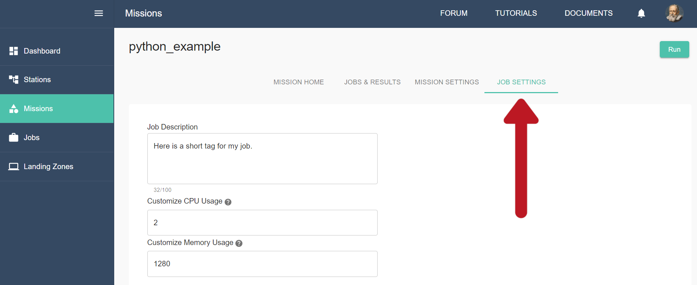

Once you have configured your Mission and Job Settings and all required input files have been added, run a job by clicking the "Run" button in the upper right. 

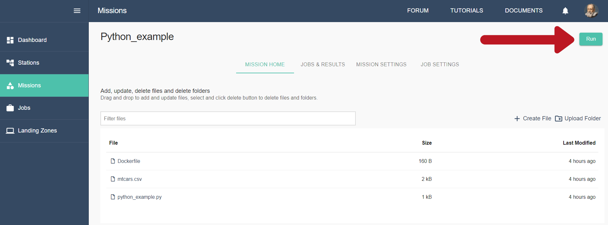

Then select the station you wish to deploy to. 

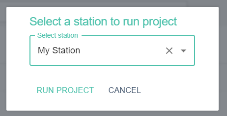

Check the job status and get past results for the current Mission by navigating to the "Jobs & Results" tab. 

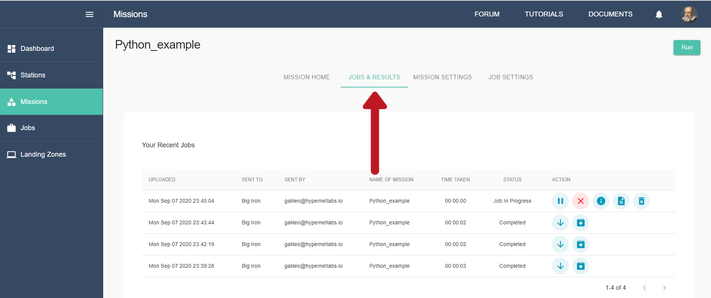

When a job is in the "running" status, you can check the progress by querying the standard output (what would normally be printed to screen if you were running the job locally on your laptop) and the process logs (to confirm what processes were created by your job). You also have the option to pause the job, cancel the job (which will return any partial results), and kill the job (which will not return any results from the job). 

A global view of all jobs, regardless of what Mission they were launched from, can be seen by clicking the jobs tab. 

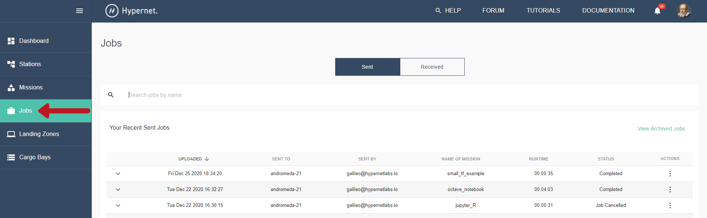
