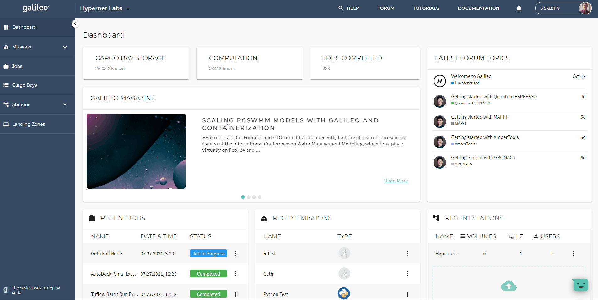
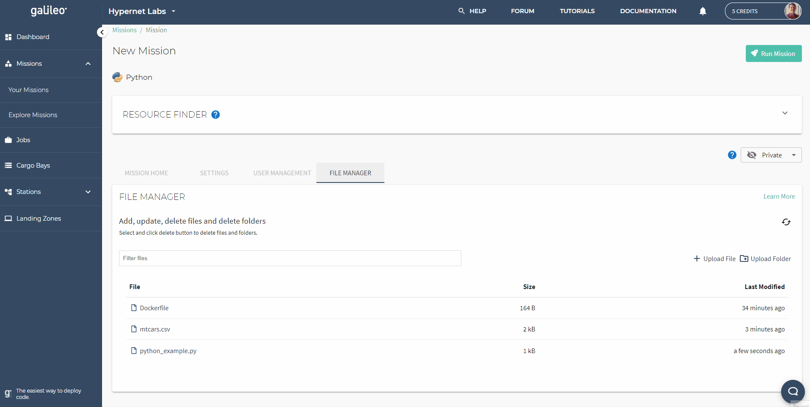
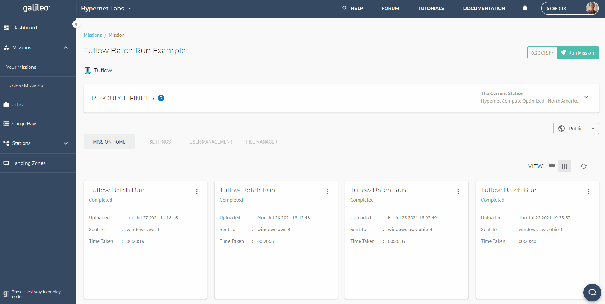

.. _missions:

Missions Guide
==============================================

Missions are a feature of Galileo that allow users to easily configure complex simulators and scripting environments to run repeatably and reliably on any `LZ <landing_zone_main.html>`_ that they have launch access to through a `Station <stations.html>`_. A Galileo Mission can be configured as either public or private. Public Missions can be cloned from the "Explore Missions" sub-tab and are a great way to share work with people in the Galileo community. 

After initial configuration, your Mission environment (which consists of your input files and framework parameters) can be updated quickly through the Mission settings page. See the `Galileo Tutorials <https://hypernetlabs.io/galileo/tutorials/#tutorials>`_ page for instructions on how to configure a Mission for specific applications. 

Creating a New Mission 
-----------------------

To create a new Mission in Galileo, go to the Missions tab on the left side of the UI. There are two ways to create a new mission. You can drag and drop a folder from your local hard-drive to the area on the UI that says "Add a Mission" (which will automatically upload the contents of that folder once the configuration step is complete), or you can start a new empty Mission by clicking the "Create a custom mission" button in the upper right.

This will launch the Mission configuration wizard which is covered in the next subsection. See the `Galileo Tutorials <https://hypernetlabs.io/galileo/tutorials/#tutorials>`_ for step-by-step instructions for specific frameworks. 

Configuring Your Mission Type
-------------------------------

Galileo supports many scripting languages (such as R, Python, Julia, and Stata) and simulators (Gromacs, HECRAS, AmberTools, etc.) right out-of-the-box. The first step in configuring your Mission is to select your target framework from the drop-down list. 

.. image:: images/missions_select_framework.gif

After you made your selection, follow the prompt to completion. 

In step 4, you can select a `Cargo Bay <cargobays.html>`_ to host your Mission data from or to point your Mission at pre-existing data you may already have stored in a third-party provider. 
 
Adding and Removing Files 
--------------------------

To see the files associated with a specific Mission, click the Missions tab on the left side of the screen, then select the particular Mission you wish to modify. This will open the home page for that Mission where you can see all files associated with it. To upload files, click the "Create File" button. This will open a file explorer (if you intend to add a folder to your Mission, you can click the "Upload Folder" button instead). Select one or more files from your file explorer to add to your Mission environment. Once the file(s) upload, they will appear in the Mission home page as show below. 

You can edit a file that you have already uploaded to a Galileo Mission by selecting the file in the file viewer, then clicking "View". This will open the file in a browser-based text editor. Click "Edit", make your changes, then save. Any further jobs you run from the Mission will reflect these changes (it will not take affect in currently running jobs). 

To delete a file from a Mission, first select the file you wish to remove by clicking on it. This will bring up a trashcan icon in the upper right. Click the trashcan icon. After confirming the deletion, the file will be permanently removed. 

Jobs Results and Job Resources 
------------------------------

Each job instance launched from a Mission, buy hitting the run button in the upper right, can be monitored from the Jobs table on that Mission's home page. When a job is in the "Job Running" status, you can check the progress by querying the standard output (what would normally be printed to screen if you were running the job locally on your laptop) and the process logs (to confirm what processes were created by your job). You also have the option (depending on the system you deployed to) to pause the job, cancel the job (which will return any partial results), and terminate the job (which will not return any results from the job). Past results can be downloaded from completed jobs clicking expanding the "Action" column for that job. 

In order to set the amount of resources that a job uses (i.e. the number of CPUs, the amount of memory, and the number of GPUs), click the settings tab under the current Mission, then scroll down to the Job Resources block and enter the values you want.

A global view of all jobs, regardless of what Mission they were launched from, can be seen by clicking the jobs tab. 

.. image:: images/jobs_tab.png

Mission Collaborators
---------------------

Mission Owners (the user who initially creates a Mission) can invite collaborators to their Mission. Collaborators can have different permission levels: Admin, View Results, and View All. Admins can do everything the Mission Owner can do except delete the Mission. The "View All" permission allows a user to view in input files and historical job results while the "View Results" permission only allows the collaborator to view historical job results for the Mission. Clicking the "plus" button on the right-hand side of the Users table will prompt for the names of the collaborators to add to the Mission.

.. image:: images/missions_collaborators.png
