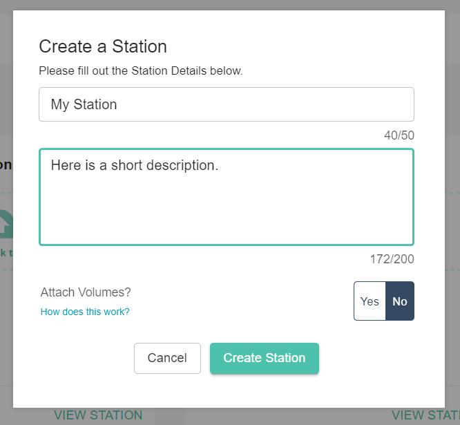

.. _stations:

Stations Guide
==============================================

Stations are a Galileo feature that make it quick and simple to share permissioned access to nearly any kind of computational resource. They also provide a build in queueing/scheduling mechanism so that Station administrators can 

Creating your own Galileo Station 
--------------------------------------

A Station can be created both in the web-based UI and through the python SDK. In order to create a station through the UI, start by clicking on the Stations tab once you've logged into your account from a webbrowser. 

.. image:: images/stations_tab.png

Next, click the 'Create Station' button in the upper right corner of the screen. 

.. image:: images/stations_create.png

This will bring up a configuration windows where you must name the Station and optionally provide a discription (which can be useful for conveying important information to Station members that you will invite later). 

Adding a Landing Zone to your Station
---------------------------------------

Now that you have created an empty Station, lets add a Landing Zone to it. Go `here <landing_zones.html>`_ to see instructions for setting up your own Landing Zone and authenticating it against your account. 

Now that you have attached a Landing Zone to your Station, you can submit jobs to it. To learn more about about launching jobs in Galileo, go here. 

Inviting Collaborators
-------------------------

To invite other Galileo users to your new Galileo Station so that they can run jobs or even contribute their own LZs, start by opening the Station settings page. 

User Roles
-----------

By default, there are three user roles available upon the creation of a new Station: Administrator, Contributor, and Launcher. 

Setting Resource Limits and Software Restrictions
---------------------------------------------------

Station administrators can set limits on the amount of resources that users can access as well as quotas. Additionally, Stations can restrict which Mission types are allowed to run on its LZ resources. 

