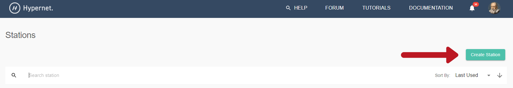
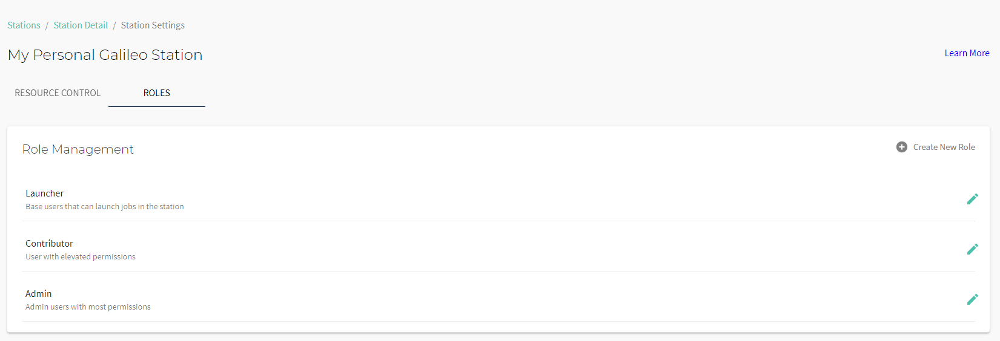

.. _stations:

Stations Guide
===============

Stations are a Galileo feature that make it quick and simple to manage permissioned access and user quotas for nearly any kind of computational asset with an internet connection. They also provide a built-in queueing/scheduling mechanism so that resource administrators can provide fair access to limited computational devices without spending hours setting up access rules and priority queues. 

Creating Your Own Galileo Station 
--------------------------------------

A Station can be created both in the web-based UI and through the Python SDK. In order to create a station through the UI, start by clicking on the Stations tab once you've logged into your account from a web browser. 

.. image:: images/stations_tab.png

Next, click the 'Create Station' button in the upper right corner of the screen. 

This will bring up a configuration window. Here, you must name the Station and optionally provide a description (which can be useful for conveying important information to Station members). 

After clicking the final "Create Station" button, you will see a new station appear in your Stations tab. At this point, you canF proceed with additional configuration of your Station, such as attaching `Landing Zones <stations.html#adding-a-landing-zone-to-your-station>`_, `inviting collaborators <stations.html#inviting-collaborators>`_, and assigning them permissioned `roles <stations.html#user-roles-and-resource-settings>`_. 

Adding a Landing Zone to Your Station
---------------------------------------

Now that you have created an empty Station, lets add a Landing Zone to it. First, go `here <landing_zones.html>`_ to see instructions for setting up your own Landing Zone and authenticating it against your account. 

After clicking the Stations Tab, select the appropriate Station. Then, to add an LZ, click the LZ tab on the main page in the middle of the page. This will bring up a list for you to choose which LZ to add (or remove) from this Station context. Select the LZ you'd like to add to the station then hit the ">" button; this will add the LZ to the "Station Landing Zones" column. Now that you have attached a Landing Zone to your Station, you can submit jobs to it. To learn more about launching jobs in Galileo, go `here <missions.html>`_. Galileo will automatically queue jobs if your LZ resources are fully utilized. Once sufficient resources on an LZ open up, queued jobs will be dispatched. 

Note: If you remove an LZ from a Station while it is still running a job, the job will continue to run until completion unless you explicitly cancel or kill the job. 

Inviting Station Members
-------------------------

To invite other Galileo users to your new Galileo Station so that they can run jobs or even contribute their own LZs (should their user role permit), start by clicking the "USERS" tab on the Station main page. This will open a list of current users and their assigned roles in the Station. Add a new Station member by clicking the "Invite User" button, searching for the user to invite, set their role, and hit "Inivte". 

User Roles and Resource Settings
---------------------------------

By default, there are three user roles available upon the creation of a new Station: Admin, Contributor, and Launcher. 

The capabilities of these roles can be customized by clicking the edit button on the role you wish to modify. Specific role permissions can be toggled on and off. These role permissions apply to the current Station context only. 

.. image:: images/stations_user_role_permissions.png

In addition to the role capabilities, resource limitations and usage quotas can be customized for each role by clicking the "resources" tab next to "permissions". Values specified here will apply to any user assigned with the associated role. These values can be left empty if you do not wish to apply custom role-specific resource/quota limitations. 

.. image:: images/stations_user_role_resources.png

In the example pictured above, any user with the Launcher role can use at most 10 CPUs and 10 GB of RAM at one time and each individual job can use at most 5 CPUs and 5 GB of RAM. Every CPU-hour will cost 4 credits and each GB-hour will cost 1 credit, so if the user runs a job for 1 hour that uses 1 CPU and 1 GB of RAM, it will cost them 5 credits which is subtracted from their quota. A quota can be set for the daily, weekly, and monthly time frame. For example, in the screen shot above, the Launcher role can use 10 credits per day, 500 credits per week, 1000 credits per month, or 10000 credits per year. As soon as the user hits one of these credit limits, they will not be able to run more jobs until the associated time period resets (so if they use up 10 credits before the end of a day, they will have to wait for the next 24 hour period for their daily credit quota to reset). 

Basic Station Settings and Resource Limits
------------------------------------------------------
To get to the Station-level settings page, click the three dots in the upper right corner of the Station main page. In the Basic Info tab of Station Settings, admins can edit the Station name and description. Descriptions must be limited to 250 characters. 

Additionally, basic resource limitations can be set that will apply to all users in the Station context. These limitations can be left empty if you do not wish to impose limitations at the Station level. The Station-level resource and quota limitations are applied to a job if there are no role-level resource/quota limitations associated with the user who submitted the job. See `User Roles and Resource Settings <stations.html#user-roles-and-resource-settings>`_ for more information about setting resource and quotas. 

.. image:: images/stations_settings_button.gif

Station Volumes
----------------

Station administrators can expose `volumes <https://docs.docker.com/storage/volumes/>`_ to jobs run within the context of a station. This can be useful in situations such as: 

* running licensed software that expects a license file to exist in a particular location
* exposing networked filesystems 
* sharing data between jobs running on the same LZ 

When a volume is added to a Station, it will only be attached to jobs that were submitted to that specific Station. An LZ attached to multiple Stations will not expose volumes to a job if it is not associated with a Station that has been configured to have a volume.  

A volume can be added to a Station by clicking the "VOLUMES" tab in the context of the relevant station. 

The volume must be given a name consisting of alpha-numeric characters and a unique mount path within the container. You must also choose if the volume will have write access via the supplied check box.

Optionally, a host path may be specified if you wish to expose a location on your host machine's hard drive that is running an LZ. First navigate to the Host Paths settings. Then specify the path on the host machine that you wish to expose at the mount path that was already set above. 

**Note:** Every job that is submitted within this Station context will mount all volumes specified here (this is why the mount path for a volume must be unique for a given Station). If you specifiy a host path for a volume, be sure that this path exists on all hosts running an LZ that is attached to this station. Otherwise, jobs submitted to LZ's on machines in which the specified host path does not exist will error at container run time.

**Note:** If you are running **Windows** containers, you must provide mount paths that are Windows compatible. For example, if you want to expose the E: drive as a volume, the **mount path** should be E: and the **host path** should both be entered as E:\\ (including the trailing slash). This tells Docker that the directory location starting at E:\\ should be exposed as E: inside the container. See the `Microsoft Docs <https://docs.microsoft.com/en-us/virtualization/windowscontainers/manage-containers/persistent-storage>`_ for specific information about exposing network file systems (SMB mounts) as volumes in Docker. 

Station Queues
----------------

Jobs that are submitted to a Station are entered into a queue. If a job is submitted and there are sufficient resources on the Station's associated LZ's, then the job will be assigned and deployed immediately, otherwise it will remain in the queued state until a slot opens or more LZs are added. Station members with sufficient permissions can vew the currently running jobs, past jobs, and all jobs currently queued and waiting for sufficient resources. 

