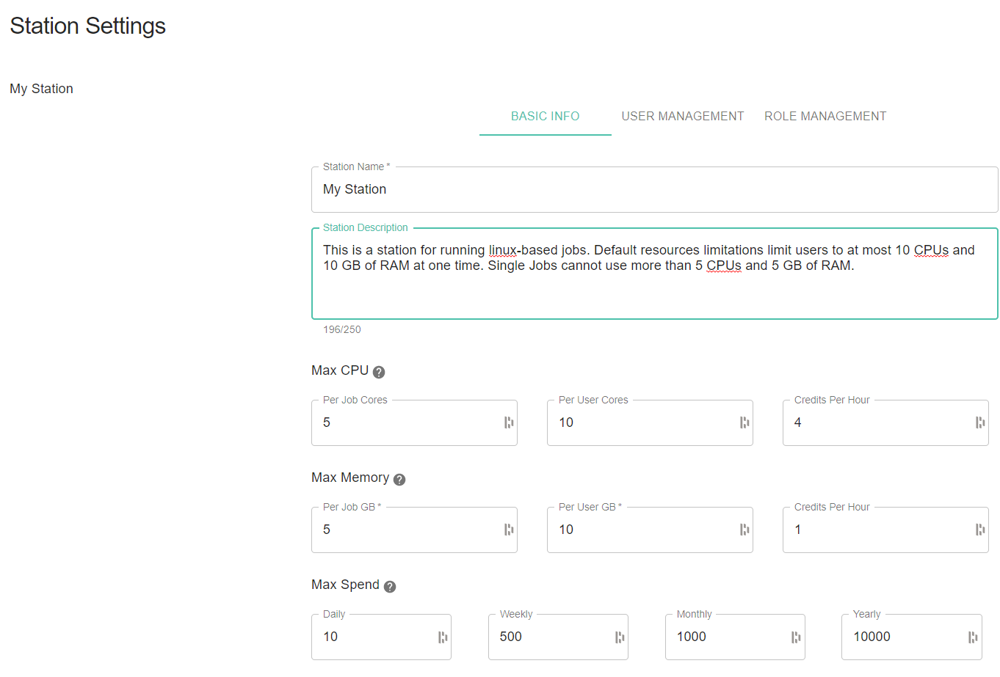

.. _stations:

Stations Guide
==============================================

Stations are a Galileo feature that make it quick and simple to share permissioned access to nearly any kind of computational resource. They also provide a built in queueing/scheduling mechanism so that Station administrators can 

Creating Your Own Galileo Station 
--------------------------------------

A Station can be created both in the web-based UI and through the python SDK. In order to create a station through the UI, start by clicking on the Stations tab once you've logged into your account from a webbrowser. 

Next, click the 'Create Station' button in the upper right corner of the screen. 

.. image:: images/stations_create.png

This will bring up a configuration window where you must name the Station and optionally provide a discription (which can be useful for conveying important information to Station members that you will invite later). 

.. image:: images/stations_name.png

After clicking the final "Create Station" button, you will see a new station appear in your Stations tab. At the point you can now proceed with additional configuration of your Station, such as attaching Landing Zones and inviting collaborators and assigning them permissioned roles. 

Adding a Landing Zone to Your Station
---------------------------------------

Now that you have created an empty Station, lets add a Landing Zone to it. First, go `here <landing_zones.html>`_ to see instructions for setting up your own Landing Zone and authenticating it against your account. 

Click on the Station box in the Stations tab. Then, to add an LZ, click the LZ button in the top-center of the Station view. 

.. image:: images/stations_add_lz.png

This will bring up a list for you to choose which LZ to add (or remove) from this Station context. Click the "+" button next to the LZ(s) you wish to attach to the Station. 

.. image:: images/stations_add_lz_2.png
    :align: center

Now that you have attached a Landing Zone to your Station, you can submit jobs to it. To learn more about about launching jobs in Galileo, go `here <missions.html>`_. Galileo will automatically queue jobs if your LZ resources are fully utilized. Once sufficient resources on an LZ opens up, queued jobs will be dispatched. 

Note: If you remove an LZ from a Station while it is still running a job, the job will still run to completion unless you explicity cancel or kill the job. 

Inviting Collaborators
-------------------------

To invite other Galileo users to your new Galileo Station so that they can run jobs or even contribute their own LZs (should their user role permit), start by opening the Station settings page by clicking the dots in the upper-right of the Station's page. 

.. image:: images/stations_settings_button.png

Next navigate to the "USER MANAGEMENT" tab. This is where you can add and remove Station members as well as assign them specific roles. 

.. image:: images/stations_user_management.png

User Roles
-----------

By default, there are three user roles available upon the creation of a new Station: Admin, Contributor, and Launcher. 

.. image:: images/stations_role_management.png

These roles can be customized by clicking the edit button on the role you wish to modify. Specific role permissions can be toggled on and off. These role permissions apply to the current Station context only. 

In addition to the role capabilities, resource limitations can be customized for each role. Values specified here will apply to any user assigned with the associated role. They can be left empty if you do not wish to have custom role resource limitations. When a job is submitted by a user in the Station with this role, the most restrictive resource limit (job specific, role specific, station specific) is the one that ultimately applies. 

.. image:: images/stations_user_role_resources.png

Setting Resource Limits and Basic Information
------------------------------------------------------

In the Basic Info tab of Station Settings, admins can edit the Station name and description.  

Additionally, basic resource limitations can be set that will apply to all users in the Station context. These limitations can be left empty if you do not wish to impose limitations at the Station level. 

Station Volumes
----------------

Station administrators can expose `volumes <https://docs.docker.com/storage/volumes/>`_ to jobs run within the context of a station. This can be useful is situations such as: 

* running licensed software that expects a license file to exist in a particular location
* exposing networked filesystems 
* sharing data between jobs running on the same LZ 

A volume can be added to a Station by clicking the volume icon in the context of the relevant station. 

.. image:: images/stations_volume.png

The volume must be given a name consisting of alpha-numeric characters and a unique mount path within the container. You must also choose if the volume will have write access via the supplied check box. 

.. image:: images/stations_volumes_mount_path.png

Optionally, a host path may be specified if you wish to expose a location on your LZ's hard drive. Remember that every job that is submitted within this Station context will mount all volumes specified here (this is why the mount path for a volume must be unique). 

If you are running windows containers, you must provide mount paths that are Windows compatible, e.g. C:\Users\Public or D:. For example, if you want do expose you E: drive as a volume, your host path and mount path should both be entered as E:.  

Station Queues
----------------

Jobs that are submitted to a Station are entered into a queue. If a job is submitted and there are sufficient resources on the Station's associated LZ's, then the job will be assigned and deployed immediately, otherwise it will remain in the queued state until a slot opens or more LZs are added. 