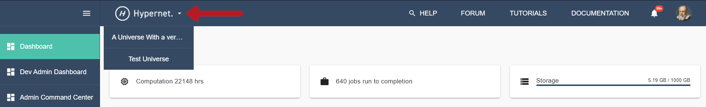
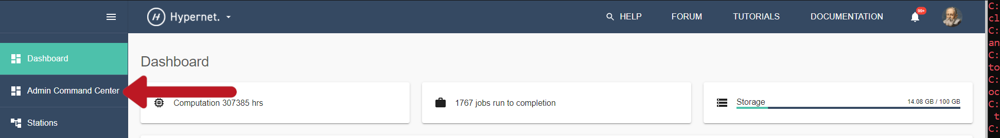
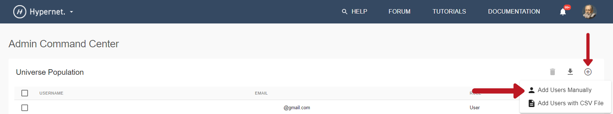
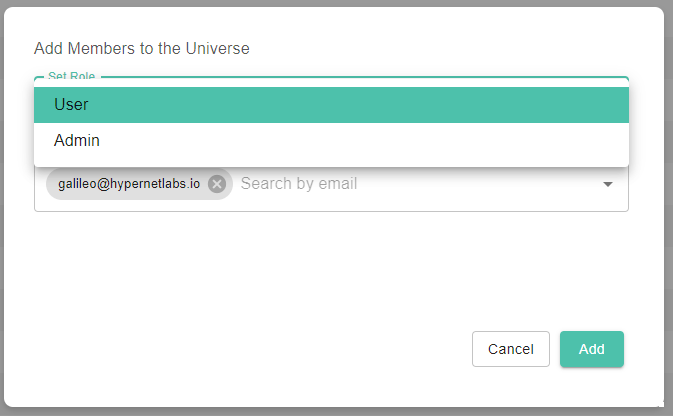
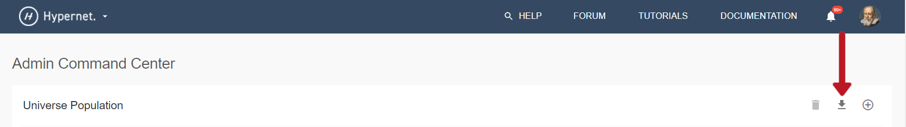

.. _universes:

Universes Guide
================

Universes are an Enterprise feature of the Galileo platform that fully partition the user space, storage,
and compute resources. Galileo Universes are appropriate for companies, universities, and other institutions
who would benefit from an isolated webapp environment to connect their internal users with their own managed resources. 
Additionally, Galileo Universes can be upgraded with custom branding and color schemes to match those of the 
institution purchasing the Universe space. 

Creating a Universe
--------------------

When a user first makes an account on Galileo, they are added to the "Hypernet" Universe. A user's active Universe 
setting is indicated by the tab in the upper left-hand portion of the screen.  

Creating a Universe requires an Enterprise account with Hypernet Labs who will initialize the Universe, set the Owner
account, and apply custom branding. To switch between different Universes, click the tab and select the desired Universe. 
This will refresh the page, changing which Stations, Missions, Landing Zones, and Cargo Bays you have access to (as instances of these features are restricted to a particular Universe context, they cannot be shared between Universes). 

Adding Universe Users
---------------------

Owners and Administrators of at least one Universe will see an extra tab on the left-hand side of their user interface when they
are in context of the Universe they administer. 

Clicking this tab will bring up the Admin Command Center. From this screen, Universe Administrators can add and remove users 
from their Universe context. Universe members can be added manually or by providing a formatted CSV file. 

Manually Adding Universe Members
~~~~~~~~~~~~~~~~~~~~~~~~~~~~~~~~

To manually add a member to a Universe, start by clicking the "plus" button on the upper right-hand side of the Admin Command 
Center, then select "Add Users Manually".

This will bring up a secondary screen where you can search the global user space and set this user's role in the Universe 
(i.e. regular member or Admin). 

Adding Members with a CSV File
~~~~~~~~~~~~~~~~~~~~~~~~~~~~~~

To add Universe members in bulk, start by clicking the "plus" button on the upper right-hand side of the Admin Command 
Center, then select "Add Users with CSV File". This will open a file explorer where you can select the appropriate text 
file from your local hard drive to upload. A template for the CSV can be obtained by clicking the download button in the 
upper right-hand side of the Admin Command Center. 

